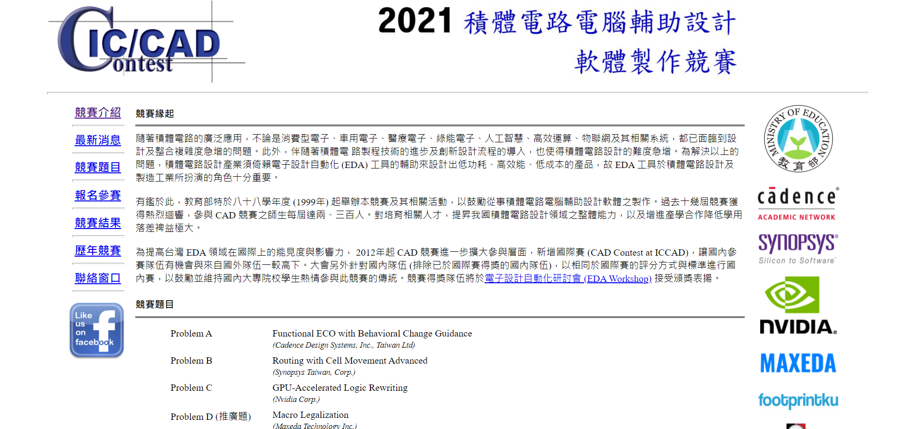

# 林子平 
- Birthday: 1999/07/20
- Education: 國立中央大學 / 電機工程學系
- E-mail: tplin1999@gmail.com
- Mobile: 0920-492-820

### 在學成績
- 平均分數86.3分
- 106學年度第一學期和第二學期書卷獎
- 108學年度大學部畢業專題成果競賽第一名

### 專長
- 熟悉 c/ c++/ python。
- 了解git運作原理。
- 能夠閱讀英文論文

### 工作經驗 
-  2018/07 - 2019/02  
    國立中央大學科學教育中心 科學營講師  
   * 設計有趣的科學實驗並帶領小學生完成實驗。  
   
    
-  2019/07 - 2021/06  
    國立中央大學圖書館 工讀生  
   * 負責處理研究生電子論文的審核。  

### 作品集 
 ## <a href="https://github.com/tplin1999/Tic_Tac_Toe_Android_Java" target="blank"><B>手機遊戲</B></a>  
    
   ⌞ 這是一個雙人遊玩的圈圈叉叉遊戲 
   ⌞ 使用 Java完成 (使用Android Studio開發)  
   ⌞ 程式碼：https://github.com/tplin1999/Tic_Tac_Toe_Android_Java    
      
 ## <a href="https://github.com/tplin1999/2021_CAD_Contest_Problem_F" target="blank"><B>2021 積體電路電腦輔助設計軟體製作競賽</B></a>  
    
   ⌞ 我選擇的是 Problem F ，題目是 Verilog Simulation Optimization via Instruction Reduction 
   ⌞ 使用 C++完成，這份程式可將 Verilog code 大幅縮減  
   ⌞ 程式碼：https://github.com/tplin1999/2021_CAD_Contest_Problem_F 
